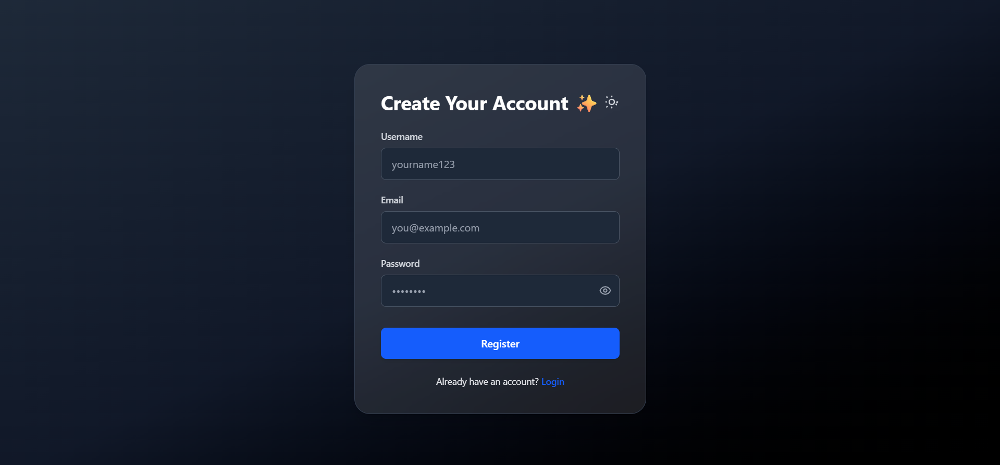
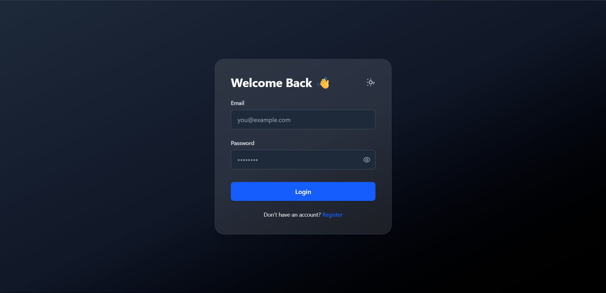
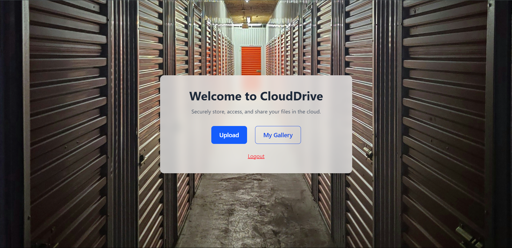

# 🔐 SecureNest

SecureNest is a secure cloud storage platform that allows users to upload, manage, and store their files safely in the cloud.

## 🛠️ Tech Stack

- **Frontend:** React  
- **Backend:** Node.js, Express.js  
- **Database:** MongoDB  
- **Cloud Storage:** Cloudinary  
- **Authentication:** JWT (JSON Web Tokens)

---

## 🚀 Features

- 🔐 Secure user authentication with JWT  
- ☁️ Upload and store files in the cloud (Cloudinary integration)  
- 🗃️ Organize and manage your uploaded files  
- 📥 Download stored files  
- 🌙 Dark mode support (optional if implemented)  
- 📦 Scalable backend using Express.js and MongoDB

---

## 📦 Installation

Clone the repository and install dependencies:

```bash
# Clone the project
git clone https://github.com/your-username/securenest.git
cd securenest

# Install backend dependencies
cd Backend
npm install

# Install frontend dependencies
cd Frontend
npm install


PORT=5000

# MongoDB
MONGO_URI=YOUR_Connection_String

# JWT
JWT_SECRET=Your_JWT_SECRET

# Cloudinary
CLOUDINARY_CLOUD_NAME=Your_Cloud_Name
CLOUDINARY_API_KEY=Your_API_KEY
CLOUDINARY_API_SECRET=Your_API_Secret


cd Backend
node index.js


cd Frontend
npm run dev


👤 Author
Harsh Pratap Singh


📷 Screenshots



